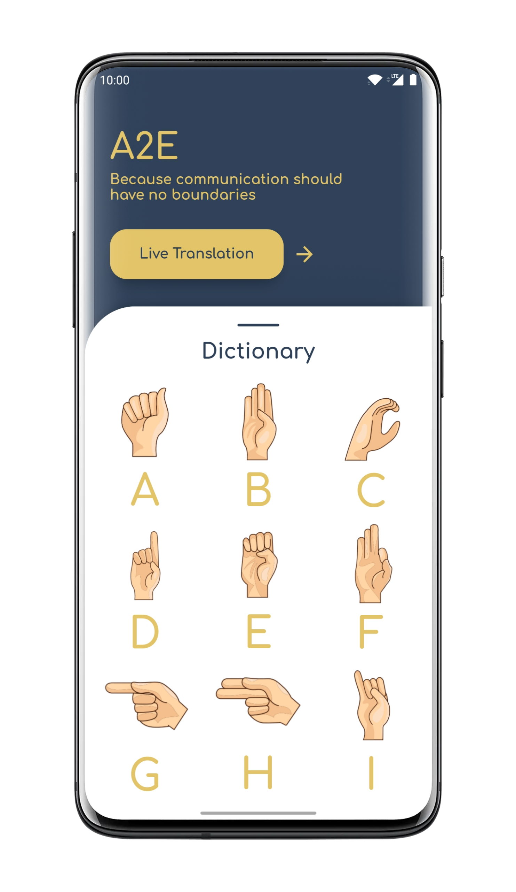
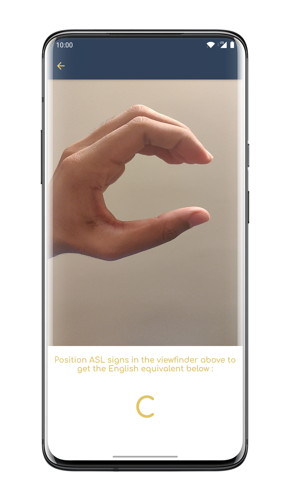
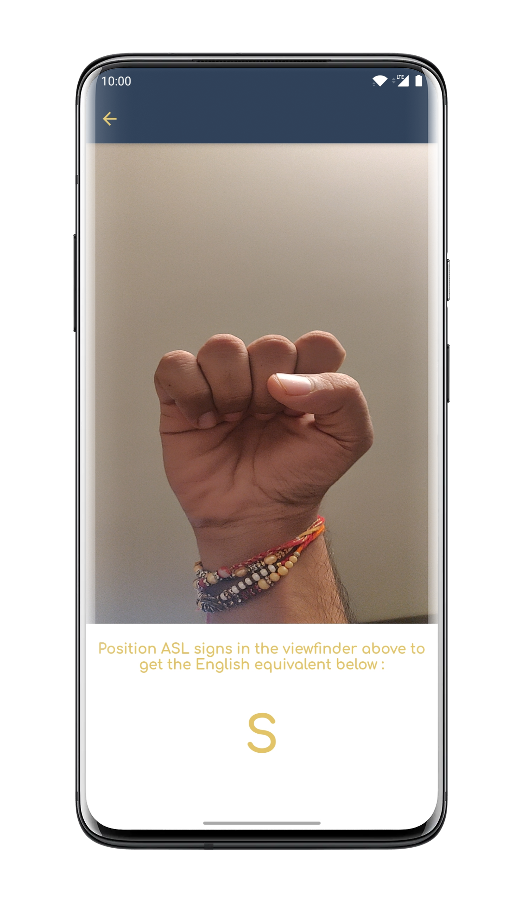

# A2E
A2E is a Flutter application which aims to close communication barriers between average and differently-abled Human Beings.
The application uses a TFLite model to enable real time deciphering of the American Sign Language alphabets to their English counterpart.

The Repository for the Model used in the Conversion is <a href= 'https://github.com/h-r-v/A2E-Model'>A2E-Model</a>.  
It contains of all the Data used for the Model, and also contains the methodology and approach used in the creation of the mentioned Model.

Download the [APK](https://github.com/rushilrai/A2E/blob/master/APK/A2E.apk) for Android.

Screenshots of the UI and functioning provided below ->

<b>Home Screen with the Dictionary for reference:</b>
 

<b>On Click of the Live Translate Button, the following viewfinder is presented, with a Live Translation Panel right below it: </b>
 
